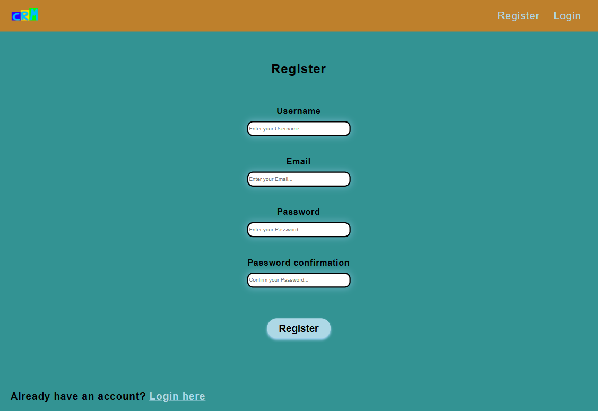
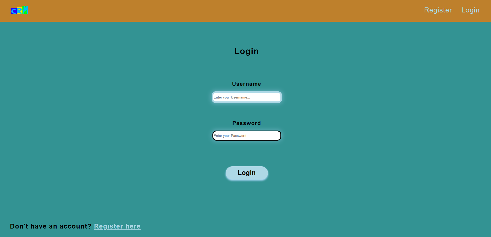
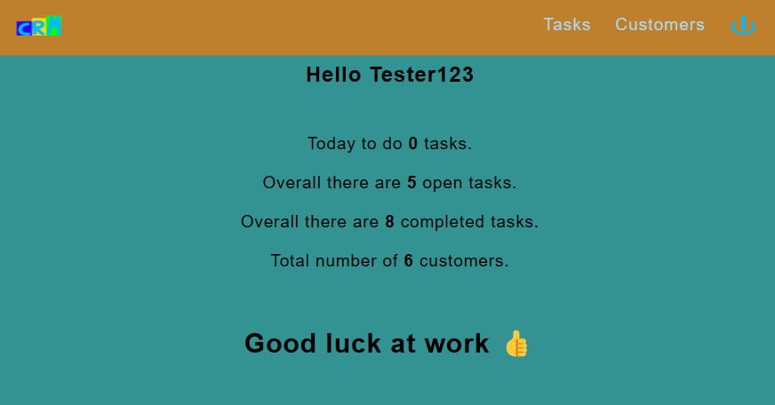
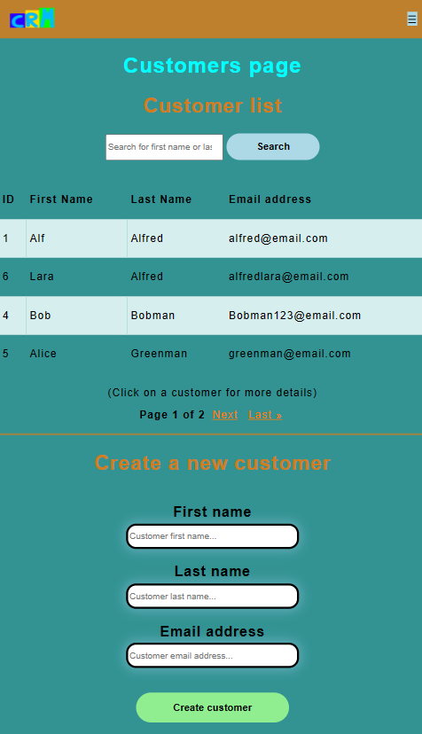
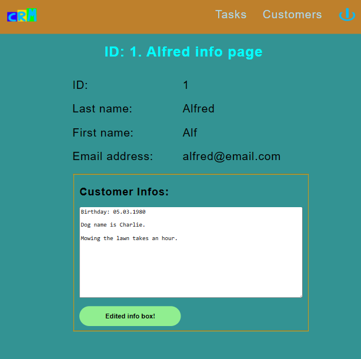
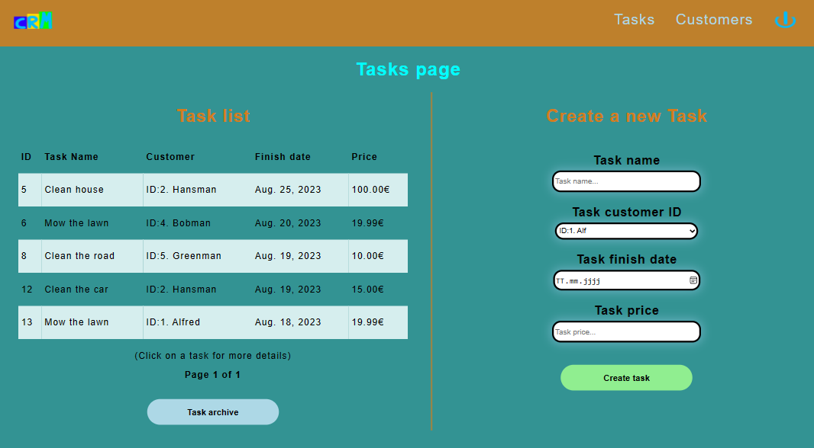
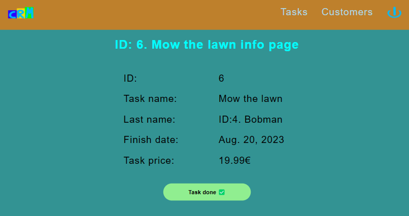
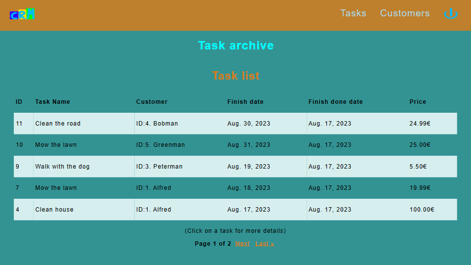

# CRM-System

!!! Before you use the program check the code and the functionality
    of the program because there can be errors. !!!

## Short Description:

My CS50 Web Development Harvard online course final project is a
CRM-System (Customer Relationship Management System) which is
programmed with Python Django Framework, Javascript, HTML, CSS and
to test I use unittest and Selenium. A CRM-System is very important
for every entrepreneur so that he can easily save all customer data,
especially customer-specific notes. When they meet again or make
another phone call, the entrepreneur can then quickly call up the
data in the CRM-System. Another important reason for a CRM-System is
that tasks are clearly sorted and displayed with the completed
date. A special in this CRM-System is that its create automatic a
PDF Bill if a task was marked as done. Even tasks that have already
been completed can be archived and you can access them in the future.

## How to use?

1. Open the Code with Github Codespace or other development
   environment
2. Install Python if not already installed
3. Go in the project directory with the command: cd capstone
4. Install Python Django Framework with the command: pip install
   django
5. Install Selenium (only for Tests) with the command: pip install
   selenium
6. Install reportlab: pip install reportlab
7. Start the Application with the command: python manage.py runserver
8. Open the web application with go to PORTS right of TERMINAL
   and open in Browser mostly Port 8000

   To run the test file please install Python Selenium, run the
   webserver and execute in the Terminal the command:
   python manage.py test functional_tests

First you have to register. The input field that you just clicked on
appears with a light blue border. Username must be longer than 5
alphanumeric characters. Password must be longer than 8 alphanumeric
characters. Email format must be right because its tested with
Regular Expression. After the successful registration you will be
logged in and lead to the Dashboard page. If you are already have
a Account you can click on Login to get the Login page.

Login Page

The Dashboard page contain some important infos. At the top of the
page is the navigation bar. There is a self designed CRM logo which
bring you back to the Dashboard page from all other pages. In the the
top right corner there is a self designed log out logo.

Clicking on customers takes you to the customers overview page where
you can register new customers, who are automatically given a
customer id. All customers are tabulated in a paginator system. With
a click on a customer id or name you get to another page with
further customer information. You can search for the last name or
first name in the search field to find the respective customer
faster. The site is programmed for all screen sizes. For screens
over 1000 pixels width, the page is laid out horizontally.

After a click on the customer id, name or email you will be
forwarded to a page with more information about the customer. Here
you can also enter further information about the customer yourself
in the info box.

To get to the task overview page, just click on the Task link in the
navigation bar. Here you can create new tasks that are assigned to
the respective customers. There is also an overview of the tasks
here. In contrast to the customer overview page, I now have a
picture of a device over 1000 pixels wide to demonstrate the
vertical arrangement.

After clicking on a task you get a page with further information
about the task and the possibility to mark a task as done. This
automatically creates a PDF invoice with all the important
information that can be printed.

The completed tasks are deleted from the task list and archived in
the task archive page. With a click on the task there are more infos
about the completed task.

## Documentation for Havard Staff:

1. First create project and start project app crm-system.
2. Handle all attitude like urls path and csrf token settings.
3. Create a layout1 template HTML file and layout1_style CSS to make
   the navbar and style it.
4. Create the navbar and search in the internet how code a
   responsive navbar hamburger for smaller device windows then 1000
   pixels.
5. Create a AbstractUser model for the user (entrepreneur) this
   is not for the customers.
6. Create a register HTML file to register the new user with
   username, email, password and password confirmation.
7. Handle the register view like in the lecture with test if
   password is match the confirmation password and if username is not
   already taken. After all tests save the new user or return him to
   register again.
8. Create register and login HTML files with formular and csrf token
   in the form.
9. Style the register and login page with CSS.
10. Add my self designed CRM and log out logos to the navigation bar.
11. Implement username and password length check.
12. Check with re library if email with an alphanumeric character,
    contain @ sign and check if domain of the email is with
    alphanumeric dot and alphanumeric.
13. Create a functional_tests folder with the test files for more
    clarity and start testing with Python Selenium the Register and
    Login page. Afterward testing the urls. Tests must be
    alphabetical sorted because the order is important.
14. Create Customer and Task database.
15. Create urls path for customers.html.
16. Split customers page with two divs one for customers list and
    the other for customers create.
17. Customers list work with the pagination function in a table and
    a search function for first and last names.
18. Reuse customers page code for the task page.
19. Create functional tests with Selenium to test the customer and
    task creation.
20. To get more infos about a customer I build the customer info
    page. There is a customer info box where the entrepreneur can
    edit important infos about the customer. Its very flexible
    because its work with Javascript.
21. Design with CSS the customer info page.
22. Create the task_info page and make the url.
23. The design of the task_info page is like the the customer_info
    page so I reuse the CSS classes.
24. The task which are completed archive in the archive page.
25. On the index page there is some important infos and a motivation
    sentence. To get to the index page (Dashboard) click CRM logo.
25. If the user click on task done in the task info page, the task
    is archived and a PDF Bill is created automatic, with all
    important infos like customer name, task done date and price.
    This is make with the reportlab library.
26. Implement a test to test if the task info and the task archive
    work right.

